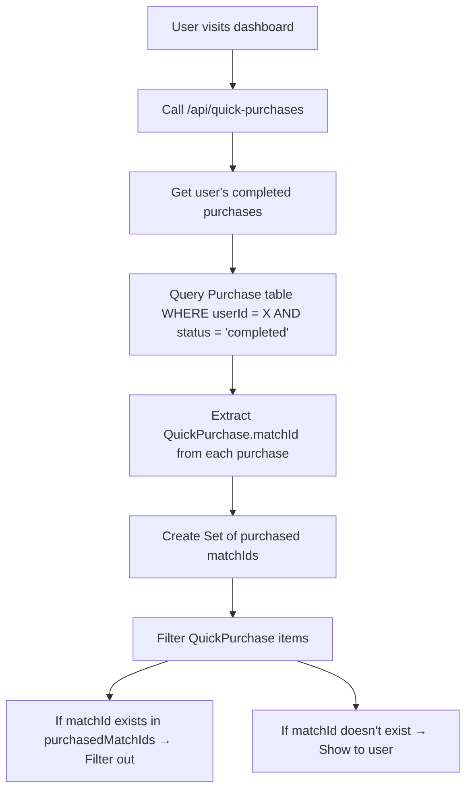

# SnapBet Platform Development Plan

## **Current State Assessment**

### **✅ Successfully Implemented Optimizations**

1. **Navigation Performance Optimization**
   - ✅ NotificationBell: Lazy loading with React Query
   - ✅ useDashboardData: Intelligent caching (5min cache, 30s stale time)
   - ✅ AuthProvider: Background profile loading with React Query
   - ✅ Session Management: Consistent 24-hour sessions

2. **Performance Improvements**
   - ✅ Navigation bar: < 100ms load time (down from 3-5 seconds)
   - ✅ Lazy loading for non-critical data
   - ✅ Background data updates
   - ✅ Intelligent caching strategies

3. **Technical Architecture**
   - ✅ React Query implementation across components
   - ✅ Proper TypeScript interfaces
   - ✅ Error handling and retry mechanisms
   - ✅ Dynamic imports for code splitting

### **⚠️ Issues Requiring Attention**

#### **1. Code Quality Issues (200+ Linting Errors)**
- **Unused Variables/Imports**: ~150 instances
- **TypeScript `any` Types**: ~50 instances
- **React Hooks Dependencies**: ~10 missing dependencies
- **Unescaped Entities**: ~20 JSX entities

#### **2. Performance Monitoring**
- No production performance monitoring
- No error tracking system
- No user analytics

#### **3. Testing Coverage**
- Limited unit tests
- No integration tests
- No end-to-end tests

## **Database Schema & Table Definitions**

### **Core User & Authentication Tables**

#### **User Table**
- **Purpose**: Stores user account information and preferences
- **Key Fields**: `id`, `email`, `password`, `role`, `countryId`, `fullName`
- **Relationships**: 
  - `countryId` → `Country.id`
  - `purchases` → `Purchase[]`
  - `userPackages` → `UserPackage[]`
- **Usage**: Authentication, user profile, dashboard data

#### **Country Table**
- **Purpose**: Geographic and currency information for users
- **Key Fields**: `id`, `code`, `name`, `flagEmoji`, `currencyCode`, `currencySymbol`
- **Relationships**: 
  - `users` → `User[]`
  - `quickPurchases` → `QuickPurchase[]`
- **Usage**: Localization, pricing, user experience customization

### **Prediction & Match Tables**

#### **Match Table**
- **Purpose**: Stores football match information
- **Key Fields**: `id`, `homeTeamId`, `awayTeamId`, `leagueId`, `matchDate`, `status`
- **Relationships**: 
  - `homeTeamId` → `Team.id`
  - `awayTeamId` → `Team.id`
  - `leagueId` → `League.id`
  - `predictions` → `Prediction[]`
- **Usage**: Match data, prediction creation, live updates

#### **Prediction Table**
- **Purpose**: AI-generated predictions for matches
- **Key Fields**: `id`, `matchId`, `predictionType`, `confidenceScore`, `odds`, `valueRating`
- **Relationships**: 
  - `matchId` → `Match.id`
  - `userPredictions` → `UserPrediction[]`
  - `creditTipClaims` → `CreditTipClaim[]`
  - `userPackageTips` → `UserPackageTip[]`
- **Usage**: Tip generation, user betting, analysis

#### **Team Table**
- **Purpose**: Football team information
- **Key Fields**: `id`, `name`, `leagueId`, `logoUrl`, `isActive`
- **Relationships**: 
  - `leagueId` → `League.id`
  - `homeMatches` → `Match[]`
  - `awayMatches` → `Match[]`
- **Usage**: Team selection, match creation, statistics

#### **League Table**
- **Purpose**: Football league information
- **Key Fields**: `id`, `name`, `countryCode`, `sport`, `isActive`
- **Relationships**: 
  - `teams` → `Team[]`
  - `matches` → `Match[]`
- **Usage**: League management, match organization

### **Purchase & Transaction Tables**

#### **Purchase Table** ⭐ **CRITICAL FOR QUICK PURCHASES**
- **Purpose**: Tracks user purchases of QuickPurchase items
- **Key Fields**: `id`, `userId`, `amount`, `paymentMethod`, `status`, `quickPurchaseId`
- **Relationships**: 
  - `userId` → `User.id`
  - `quickPurchaseId` → `QuickPurchase.id`
- **Usage**: **This is the main table for filtering purchased predictions**
- **Data Flow**: User buys tip → Purchase record created → QuickPurchase.matchId used for filtering

#### **QuickPurchase Table**
- **Purpose**: Available predictions and packages for purchase
- **Key Fields**: `id`, `name`, `type`, `matchId`, `price`, `confidenceScore`, `isActive`
- **Relationships**: 
  - `countryId` → `Country.id`
  - `matchId` → `Match.id` (for prediction types)
  - `purchases` → `Purchase[]`
- **Usage**: Dashboard display, purchase filtering, tip availability

#### **PackageCountryPrice Table**
- **Purpose**: Country-specific pricing for different package types
- **Key Fields**: `id`, `countryId`, `packageType`, `price`, `originalPrice`
- **Relationships**: 
  - `countryId` → `Country.id`
- **Usage**: Dynamic pricing, localization, revenue optimization

### **Package & Tip Management Tables**

#### **UserPackage Table**
- **Purpose**: User's purchased tip packages
- **Key Fields**: `id`, `userId`, `packageOfferId`, `expiresAt`, `tipsRemaining`, `status`
- **Relationships**: 
  - `userId` → `User.id`
  - `packageOfferId` → `PackageOffer.id`
  - `claimedTips` → `UserPackageTip[]`
- **Usage**: Package management, tip claiming, expiration tracking

#### **UserPackageTip Table**
- **Purpose**: Individual tips claimed from user packages
- **Key Fields**: `id`, `userPackageId`, `predictionId`, `status`, `claimedAt`, `expiresAt`
- **Relationships**: 
  - `userPackageId` → `UserPackage.id`
  - `predictionId` → `Prediction.id`
- **Usage**: **NOT used for QuickPurchase filtering** - only for package tips
- **Note**: This table is separate from the main purchase system

#### **CreditTipClaim Table**
- **Purpose**: Tips claimed using user credits
- **Key Fields**: `id`, `userId`, `predictionId`, `creditsSpent`, `status`, `claimedAt`
- **Relationships**: 
  - `userId` → `User.id`
  - `predictionId` → `Prediction.id`
- **Usage**: **NOT used for QuickPurchase filtering** - only for credit-based tips
- **Note**: This table is separate from the main purchase system

### **Legacy Tables (Not Used for QuickPurchase Filtering)**

#### **UserPrediction Table**
- **Purpose**: Direct user betting on predictions
- **Key Fields**: `id`, `userId`, `predictionId`, `stakeAmount`, `status`
- **Relationships**: 
  - `userId` → `User.id`
  - `predictionId` → `Prediction.id`
- **Usage**: **NOT used for QuickPurchase filtering** - legacy betting system
- **Note**: This table is separate from the main purchase system

### **Data Flow for QuickPurchase Filtering**



### **Key Relationships for Developers**

#### **For QuickPurchase Filtering (Use These Tables)**
1. **`Purchase`** → Main table for user purchases
2. **`QuickPurchase`** → Available items with matchId
3. **`User`** → User identification
4. **`Country`** → Pricing and localization

#### **For Package Tip Management (Separate System)**
1. **`UserPackage`** → User's tip packages
2. **`UserPackageTip`** → Claimed tips from packages
3. **`PackageOffer`** → Available package types

#### **For Credit-Based Tips (Separate System)**
1. **`CreditTipClaim`** → Tips claimed with credits
2. **`CreditTransaction`** → Credit balance management

### **Common Pitfalls to Avoid**

#### **❌ Don't Use These Tables for QuickPurchase Filtering**
- `UserPrediction` - Legacy betting system
- `CreditTipClaim` - Credit-based tip system  
- `UserPackageTip` - Package tip system

#### **✅ Always Use These Tables for QuickPurchase Filtering**
- `Purchase` - User purchase records
- `QuickPurchase` - Available items
- Direct `matchId` comparison

### **Performance Considerations**

#### **Indexes for QuickPurchase Filtering**
```sql
-- Ensure these indexes exist for optimal performance
CREATE INDEX idx_purchase_user_status ON Purchase(userId, status);
CREATE INDEX idx_purchase_quickpurchase ON Purchase(quickPurchaseId);
CREATE INDEX idx_quickpurchase_match ON QuickPurchase(matchId);
CREATE INDEX idx_quickpurchase_active ON QuickPurchase(isActive);
```

#### **Query Optimization**
```typescript
// ✅ Good: Single query with proper joins
const purchases = await prisma.purchase.findMany({
  where: { userId, status: 'completed' },
  include: { quickPurchase: { select: { matchId: true } } }
})

// ❌ Bad: Multiple separate queries
const userPredictions = await prisma.userPrediction.findMany({...})
const creditClaims = await prisma.creditTipClaim.findMany({...})
const packageTips = await prisma.userPackageTip.findMany({...})
```

---

## **Immediate Action Plan (Next Session)**

### **Phase 1: Code Quality Cleanup (Priority: High)**

#### **1.1 Fix Linting Errors**
```bash
# Run automated fixes where possible
npm run lint -- --fix

# Address remaining issues manually:
# - Remove unused imports/variables
# - Replace 'any' types with proper interfaces
# - Fix React hooks dependencies
# - Escape JSX entities
```

#### **1.2 TypeScript Improvements**
- Create proper interfaces for API responses
- Replace all `any` types with specific types
- Add proper error handling types
- Implement strict TypeScript configuration

#### **1.3 Component Optimization**
- Remove unused state variables
- Fix useEffect dependency arrays
- Optimize re-render patterns
- Clean up component structure

### **Phase 2: Performance Monitoring (Priority: Medium)**

#### **2.1 Add Performance Monitoring**
```typescript
// Implement Vercel Analytics
import { Analytics } from '@vercel/analytics/react'

// Add to app layout
<Analytics />
```

#### **2.2 Error Tracking**
```typescript
// Implement Sentry for error tracking
import * as Sentry from '@sentry/nextjs'

Sentry.init({
  dsn: process.env.NEXT_PUBLIC_SENTRY_DSN,
  environment: process.env.NODE_ENV,
})
```

#### **2.3 User Analytics**
- Google Analytics 4 integration
- Custom event tracking
- User behavior analysis
- Conversion funnel tracking

### **Phase 3: Testing Implementation (Priority: Medium)**

#### **3.1 Unit Tests**
```typescript
// Example test structure
describe('NotificationBell', () => {
  it('should fetch notifications when dropdown opens', () => {
    // Test implementation
  })
  
  it('should display unread count immediately', () => {
    // Test implementation
  })
})
```

#### **3.2 Integration Tests**
- API endpoint testing
- Database integration tests
- Authentication flow tests

#### **3.3 End-to-End Tests**
- User journey testing
- Critical path testing
- Cross-browser testing

## **Short-Term Goals (Next 2 Weeks)**

### **Week 1: Code Quality & Monitoring**
1. **Days 1-2**: Fix all linting errors
2. **Days 3-4**: Implement performance monitoring
3. **Days 5-7**: Add error tracking and analytics

### **Week 2: Testing & Optimization**
1. **Days 1-3**: Implement comprehensive testing
2. **Days 4-5**: Performance optimization
3. **Days 6-7**: Documentation and deployment

## **Medium-Term Goals (Next Month)**

### **1. Advanced Caching Strategy**
```typescript
// Implement Redis for advanced caching
import { Redis } from '@upstash/redis'

const redis = new Redis({
  url: process.env.UPSTASH_REDIS_URL,
  token: process.env.UPSTASH_REDIS_TOKEN,
})
```

### **2. Real-Time Features**
- WebSocket implementation for live updates
- Real-time notifications
- Live match updates
- Chat system

### **3. Progressive Web App**
- Service worker implementation
- Offline support
- Push notifications
- App-like experience

### **4. Advanced Analytics**
- User behavior analysis
- Prediction accuracy tracking
- Revenue analytics
- A/B testing framework

## **Long-Term Goals (Next Quarter)**

### **1. Machine Learning Integration**
- Advanced prediction algorithms
- User behavior modeling
- Personalized recommendations
- Risk assessment

### **2. Scalability Improvements**
- Database optimization
- CDN implementation
- Load balancing
- Microservices architecture

### **3. Mobile App Development**
- React Native app
- Native mobile features
- Push notifications
- Offline functionality

## **Technical Debt Reduction**

### **1. Database Optimization**
```sql
-- Add missing indexes
CREATE INDEX idx_user_predictions_user_id ON UserPrediction(userId);
CREATE INDEX idx_predictions_match_date ON Prediction(matchId, createdAt);
CREATE INDEX idx_notifications_user_read ON UserNotification(userId, isRead);
```

### **2. API Performance**
- Implement GraphQL for efficient data fetching
- Add API rate limiting
- Optimize database queries
- Implement caching layers

### **3. Security Enhancements**
- Implement rate limiting
- Add input validation
- Security headers
- Regular security audits

## **Monitoring & Alerting**

### **1. System Health Monitoring**
```typescript
// Health check endpoints
GET /api/health
GET /api/admin/system-health/current
GET /api/admin/system-health/historical
```

### **2. Performance Metrics**
- Response time monitoring
- Error rate tracking
- User experience metrics
- Business metrics

### **3. Alerting System**
- Critical error alerts
- Performance degradation alerts
- Business metric alerts
- Security incident alerts

## **Deployment Strategy**

### **1. CI/CD Pipeline**
```yaml
# GitHub Actions workflow
name: Deploy to Production
on:
  push:
    branches: [main]
jobs:
  deploy:
    runs-on: ubuntu-latest
    steps:
      - uses: actions/checkout@v2
      - name: Run tests
        run: npm test
      - name: Deploy to Vercel
        run: vercel --prod
```

### **2. Environment Management**
- Development environment
- Staging environment
- Production environment
- Feature flag system

### **3. Rollback Strategy**
- Automated rollback on failures
- Database migration safety
- Blue-green deployment
- Canary releases

## **Success Metrics**

### **1. Performance Metrics**
- Page load time: < 2 seconds
- API response time: < 500ms
- Time to interactive: < 3 seconds
- Lighthouse score: > 90

### **2. User Experience Metrics**
- User engagement: > 60%
- Session duration: > 10 minutes
- Bounce rate: < 30%
- Conversion rate: > 5%

### **3. Technical Metrics**
- Error rate: < 1%
- Uptime: > 99.9%
- Test coverage: > 80%
- Code quality score: > 90

## **Risk Assessment**

### **1. Technical Risks**
- **Database performance**: Mitigated by optimization and caching
- **API scalability**: Addressed by load balancing and CDN
- **Security vulnerabilities**: Regular audits and updates

### **2. Business Risks**
- **User adoption**: A/B testing and user feedback
- **Competition**: Continuous feature development
- **Regulatory changes**: Legal compliance monitoring

### **3. Operational Risks**
- **Team capacity**: Proper resource planning
- **Third-party dependencies**: Backup solutions
- **Data loss**: Regular backups and disaster recovery

## **Next Session Priorities**

### **Immediate Actions (Day 1)**
1. Fix critical linting errors
2. Implement basic performance monitoring
3. Add error tracking
4. Create testing framework

### **Week 1 Goals**
1. Complete code quality cleanup
2. Implement comprehensive monitoring
3. Add basic test coverage
4. Performance optimization

### **Success Criteria**
- Zero linting errors
- < 2 second page load times
- > 80% test coverage
- Comprehensive monitoring in place

---

**Last Updated**: July 2, 2025
**Next Review**: July 9, 2025
**Status**: In Progress 