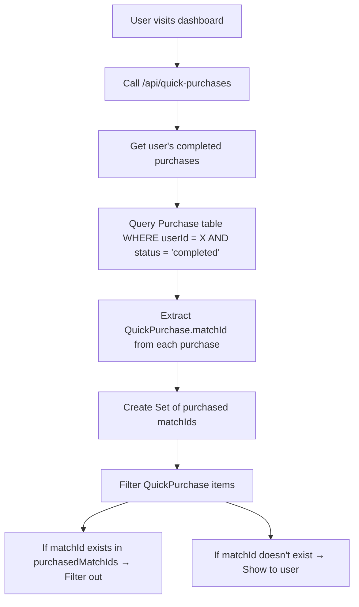

# SnapBet Platform Development Plan

## **Current State Assessment**

### **✅ Successfully Implemented Optimizations**

1. **Navigation Performance Optimization**
   - ✅ NotificationBell: Lazy loading with React Query
   - ✅ useDashboardData: Intelligent caching (5min cache, 30s stale time)
   - ✅ AuthProvider: Background profile loading with React Query
   - ✅ Session Management: Consistent 24-hour sessions

2. **Performance Improvements**
   - ✅ Navigation bar: < 100ms load time (down from 3-5 seconds)
   - ✅ Lazy loading for non-critical data
   - ✅ Background data updates
   - ✅ Intelligent caching strategies

3. **Technical Architecture**
   - ✅ React Query implementation across components
   - ✅ Proper TypeScript interfaces
   - ✅ Error handling and retry mechanisms
   - ✅ Dynamic imports for code splitting

4. **Cron Job Removal & Integration (September 2025)**
   - ✅ Removed automated cron job functionality
   - ✅ Deleted related scripts and configurations
   - ✅ Updated admin UI for manual sync/enrich process
   - ✅ Added comprehensive logging for debugging

5. **Prediction Details Modal Enhancement (September 2025)**
   - ✅ Enhanced modal to display comprehensive betting information
   - ✅ Fixed NaN values in Additional Markets (Total Goals, Asian Handicap)
   - ✅ Corrected API data extraction for prediction payload
   - ✅ Implemented professional UI with structured information architecture
   - ✅ Maintained full TypeScript compliance

6. **GitHub CI/CD Fixes & Dashboard Enhancements (September 14, 2025)**
   - ✅ Resolved all GitHub CI/CD failures (TypeScript errors, unused variables, JSON syntax)
   - ✅ Enhanced Dashboard Matches page with improved filtering and display
   - ✅ Redesigned My-Tips page with time-based organization and enhanced modal
   - ✅ Fixed League Management component (`setSyncStatus is not defined` error)
   - ✅ Corrected data processing issues (NaN values, confidence display)
   - ✅ Improved API data extraction and transformation logic

7. **Match Detail Page & SEO Overhaul (February 2026)** 🆕
   - ✅ Implemented `/match/[slug]` route with SEO-friendly slugs (`teamA-vs-teamB-prediction`)
   - ✅ Dynamic OG image generation with team names, logos, and match metadata
   - ✅ Server-rendered `<article>` content for search engine crawlers (visually hidden, SEO-rich)
   - ✅ JSON-LD structured data: `SportsEvent`, `BreadcrumbList`, `FAQPage`
   - ✅ Dynamic sitemap generation using SEO slugs (`app/sitemap-matches.xml/route.ts`)
   - ✅ Programmatic `robots.ts` (removed conflicting `public/robots.txt`)
   - ✅ Premium content gating with blur overlay (conditional on match status — unlocked for finished matches)
   - ✅ Interactive betting slip with sportsbook deep-links (FanDuel, DraftKings, BetMGM, etc.)
   - ✅ Smart Value Picks engine using edge, EV, and CLV calculations
   - ✅ Selectable picks for Match Result (1X2), Advanced Markets, and Correct Scores
   - ✅ Live match support via WebSocket (`useLiveMatchWebSocket`)
   - ✅ Finished match stats display with score validation (shows "Score unavailable" instead of misleading "0-0")
   - ✅ Above-the-fold premium CTA banner for conversion
   - ✅ Urgency countdown for upcoming matches
   - ✅ External API timeout handling with `AbortController` and database fallback
   - ✅ Score data persistence: API auto-persists `finalResult` to database for finished matches

8. **Dashboard Matches & Matches Pages Redesign (February 2026)** 🆕
   - ✅ Complete visual redesign of `/dashboard/matches` with modern gradient UI
   - ✅ Data loading optimizations: server-side filtering, payload reduction, batched queries
   - ✅ Server-side filtering for null `predictionData` and upcoming-only matches
   - ✅ Redesigned `/matches` page aligned with modern design system
   - ✅ Match detail navigation buttons on each card

9. **Shared Component Library (February 2026)** 🆕
   - ✅ Extracted `ConfidenceRing` and `SkeletonCard` into `components/match/shared.tsx`
   - ✅ Extracted helper functions: `getRelativeTime`, `getUrgency`, `getConfidenceColor`, `formatPrediction`, `getMatchStatus`
   - ✅ Created `components/match/FinishedMatchStats.tsx` for completed match display
   - ✅ Created `app/match/[slug]/BetSlip.tsx` for interactive betting slip
   - ✅ Both `/dashboard/matches` and `/matches` now consume shared components
   - ✅ Slug utilities split into client-safe (`lib/match-slug.ts`) and server-only (`lib/match-slug-server.ts`)
   - ✅ `lib/market-match-helpers.ts` for MarketMatch → API response transformation

## **User Flow Overview**

The SnapBet platform follows a clear user journey: **Discovery → Exploration → Purchase → Access**. For complete flow documentation, see [USER_FLOW_DOCUMENTATION.md](./USER_FLOW_DOCUMENTATION.md).

### **Current Flow**
1. **Homepage** (`/`) - Users discover matches via `OddsPredictionTable`
2. **Public Browse** (`/matches`) - Unauthenticated users browse available predictions with modern card UI
3. **Authenticated Browse** (`/dashboard/matches`) - Users see available upcoming matches (purchased filtered out, null predictions excluded)
4. **Match Detail** (`/match/[slug]`) - SEO-friendly match analysis page with:
   - Free content: AI analysis summary, team stats, bookmaker odds, model predictions
   - Premium content (gated): Edge %, Fair Odds, Value Rating, Risk Tier, Confidence Score, Parlay Compatibility, Suggested Bet Structure
   - Premium gates are **removed for finished matches** (all content becomes free)
   - Interactive betting slip with sportsbook deep-links
   - Live match updates via WebSocket
   - Finished match stats with score display
5. **Purchase** - `QuickPurchaseModal` handles payment via Stripe
6. **My Tips** (`/dashboard/my-tips`) - Users access purchased predictions with full analysis

### **Key Data Flow**
- **Purchase Filtering**: `Purchase` table → Extract `matchId` → Filter `QuickPurchase` items
- **Prediction Models**: V1 (free/visible) vs V2 (premium/masked)
- **Slug Resolution**: SEO slug → `lib/match-slug-server.ts` → `resolveSlugToMatchId()` → Database lookup with `unaccent()` for diacritic-safe matching
- **Match Data**: `/api/match/[match_id]` → Database (MarketMatch + QuickPurchase) → External API fallback with 5s timeout → Auto-persist scores
- **API Integration**: `/api/market`, `/api/predictions/predict`, `/api/my-tips`, `/api/quick-purchases`, `/api/match/[match_id]`, `/api/match/[match_id]/purchase-status`

### **⚠️ Issues Requiring Attention**

#### **1. ~~Missing Match Detail Page~~ ✅ RESOLVED (February 2026)**
- **Status**: ✅ **IMPLEMENTED** — Full-featured `/match/[slug]` route with SEO, premium gating, betting slip, live support, and finished match handling.
- See Section 7 above for complete details.

#### **2. Sync & Enrich Integration Not Working** 🚨 **HIGH PRIORITY**
- **Problem**: "Sync & Enrich Matches" button not calling `/predict` endpoint
- **Impact**: 0 enriched records despite processing 44 matches
- **Status**: ❌ **BROKEN** - Needs immediate debugging
- **Working Alternative**: "Enrich All Predictions (Smart)" button works perfectly

#### **3. Finished Match Score Data Gaps** ⚠️ **MEDIUM PRIORITY**
- **Problem**: ~371 finished matches in the database have missing `finalResult` (174 `null`, 197 empty `{}`)
- **Impact**: Finished match pages show "Score unavailable" instead of actual scores
- **Mitigation**: API now auto-fetches and persists scores from external API on page visit, but external API has availability gaps (504 timeouts)
- **Recommendation**: Run a batch backfill script to populate `finalResult` for all finished matches

#### **4. Code Quality Issues (200+ Linting Errors)**
- **Unused Variables/Imports**: ~150 instances
- **TypeScript `any` Types**: ~50 instances
- **React Hooks Dependencies**: ~10 missing dependencies
- **Unescaped Entities**: ~20 JSX entities

#### **5. Performance Monitoring**
- No production performance monitoring
- No error tracking system
- No user analytics

#### **6. Testing Coverage**
- Limited unit tests
- No integration tests
- No end-to-end tests

## **Database Schema & Table Definitions**

### **Core User & Authentication Tables**

#### **User Table**
- **Purpose**: Stores user account information and preferences
- **Key Fields**: `id`, `email`, `password`, `role`, `countryId`, `fullName`
- **Relationships**: 
  - `countryId` → `Country.id`
  - `purchases` → `Purchase[]`
  - `userPackages` → `UserPackage[]`
- **Usage**: Authentication, user profile, dashboard data

#### **Country Table**
- **Purpose**: Geographic and currency information for users
- **Key Fields**: `id`, `code`, `name`, `flagEmoji`, `currencyCode`, `currencySymbol`
- **Relationships**: 
  - `users` → `User[]`
  - `quickPurchases` → `QuickPurchase[]`
- **Usage**: Localization, pricing, user experience customization

### **Prediction & Match Tables**

#### **Match Table**
- **Purpose**: Stores football match information
- **Key Fields**: `id`, `homeTeamId`, `awayTeamId`, `leagueId`, `matchDate`, `status`
- **Relationships**: 
  - `homeTeamId` → `Team.id`
  - `awayTeamId` → `Team.id`
  - `leagueId` → `League.id`
  - `predictions` → `Prediction[]`
- **Usage**: Match data, prediction creation, live updates

#### **Prediction Table**
- **Purpose**: AI-generated predictions for matches
- **Key Fields**: `id`, `matchId`, `predictionType`, `confidenceScore`, `odds`, `valueRating`
- **Relationships**: 
  - `matchId` → `Match.id`
  - `userPredictions` → `UserPrediction[]`
  - `creditTipClaims` → `CreditTipClaim[]`
  - `userPackageTips` → `UserPackageTip[]`
- **Usage**: Tip generation, user betting, analysis

#### **Team Table**
- **Purpose**: Football team information
- **Key Fields**: `id`, `name`, `leagueId`, `logoUrl`, `isActive`
- **Relationships**: 
  - `leagueId` → `League.id`
  - `homeMatches` → `Match[]`
  - `awayMatches` → `Match[]`
- **Usage**: Team selection, match creation, statistics

#### **League Table**
- **Purpose**: Football league information
- **Key Fields**: `id`, `name`, `countryCode`, `sport`, `isActive`
- **Relationships**: 
  - `teams` → `Team[]`
  - `matches` → `Match[]`
- **Usage**: League management, match organization

### **Purchase & Transaction Tables**

#### **Purchase Table** ⭐ **CRITICAL FOR QUICK PURCHASES**
- **Purpose**: Tracks user purchases of QuickPurchase items
- **Key Fields**: `id`, `userId`, `amount`, `paymentMethod`, `status`, `quickPurchaseId`
- **Relationships**: 
  - `userId` → `User.id`
  - `quickPurchaseId` → `QuickPurchase.id`
- **Usage**: **This is the main table for filtering purchased predictions**
- **Data Flow**: User buys tip → Purchase record created → QuickPurchase.matchId used for filtering

#### **QuickPurchase Table**
- **Purpose**: Available predictions and packages for purchase
- **Key Fields**: `id`, `name`, `type`, `matchId`, `price`, `confidenceScore`, `isActive`
- **Relationships**: 
  - `countryId` → `Country.id`
  - `matchId` → `Match.id` (for prediction types)
  - `purchases` → `Purchase[]`
- **Usage**: Dashboard display, purchase filtering, tip availability

#### **PackageCountryPrice Table**
- **Purpose**: Country-specific pricing for different package types
- **Key Fields**: `id`, `countryId`, `packageType`, `price`, `originalPrice`
- **Relationships**: 
  - `countryId` → `Country.id`
- **Usage**: Dynamic pricing, localization, revenue optimization

### **Package & Tip Management Tables**

#### **UserPackage Table**
- **Purpose**: User's purchased tip packages
- **Key Fields**: `id`, `userId`, `packageOfferId`, `expiresAt`, `tipsRemaining`, `status`
- **Relationships**: 
  - `userId` → `User.id`
  - `packageOfferId` → `PackageOffer.id`
  - `claimedTips` → `UserPackageTip[]`
- **Usage**: Package management, tip claiming, expiration tracking

#### **UserPackageTip Table**
- **Purpose**: Individual tips claimed from user packages
- **Key Fields**: `id`, `userPackageId`, `predictionId`, `status`, `claimedAt`, `expiresAt`
- **Relationships**: 
  - `userPackageId` → `UserPackage.id`
  - `predictionId` → `Prediction.id`
- **Usage**: **NOT used for QuickPurchase filtering** - only for package tips
- **Note**: This table is separate from the main purchase system

#### **CreditTipClaim Table**
- **Purpose**: Tips claimed using user credits
- **Key Fields**: `id`, `userId`, `predictionId`, `creditsSpent`, `status`, `claimedAt`
- **Relationships**: 
  - `userId` → `User.id`
  - `predictionId` → `Prediction.id`
- **Usage**: **NOT used for QuickPurchase filtering** - only for credit-based tips
- **Note**: This table is separate from the main purchase system

### **Legacy Tables (Not Used for QuickPurchase Filtering)**

#### **UserPrediction Table**
- **Purpose**: Direct user betting on predictions
- **Key Fields**: `id`, `userId`, `predictionId`, `stakeAmount`, `status`
- **Relationships**: 
  - `userId` → `User.id`
  - `predictionId` → `Prediction.id`
- **Usage**: **NOT used for QuickPurchase filtering** - legacy betting system
- **Note**: This table is separate from the main purchase system

### **Data Flow for QuickPurchase Filtering**


```mermaid
graph TD
    A[User visits dashboard] --> B[Call /api/quick-purchases]
    B --> C[Get user's completed purchases]
    C --> D[Query Purchase table WHERE userId = X AND status = 'completed']
    D --> E[Extract QuickPurchase.matchId from each purchase]
    E --> F[Create Set of purchased matchIds]
    F --> G[Filter QuickPurchase items]
    G --> H[If matchId exists in purchasedMatchIds → Filter out]
    G --> I[If matchId doesn't exist → Show to user]
```

### **Key Relationships for Developers**

#### **For QuickPurchase Filtering (Use These Tables)**
1. **`Purchase`** → Main table for user purchases
2. **`QuickPurchase`** → Available items with matchId
3. **`User`** → User identification
4. **`Country`** → Pricing and localization

#### **For Package Tip Management (Separate System)**
1. **`UserPackage`** → User's tip packages
2. **`UserPackageTip`** → Claimed tips from packages
3. **`PackageOffer`** → Available package types

#### **For Credit-Based Tips (Separate System)**
1. **`CreditTipClaim`** → Tips claimed with credits
2. **`CreditTransaction`** → Credit balance management

### **Common Pitfalls to Avoid**

#### **❌ Don't Use These Tables for QuickPurchase Filtering**
- `UserPrediction` - Legacy betting system
- `CreditTipClaim` - Credit-based tip system  
- `UserPackageTip` - Package tip system

#### **✅ Always Use These Tables for QuickPurchase Filtering**
- `Purchase` - User purchase records
- `QuickPurchase` - Available items
- Direct `matchId` comparison

### **Performance Considerations**

#### **Indexes for QuickPurchase Filtering**
```sql
-- Ensure these indexes exist for optimal performance
CREATE INDEX idx_purchase_user_status ON Purchase(userId, status);
CREATE INDEX idx_purchase_quickpurchase ON Purchase(quickPurchaseId);
CREATE INDEX idx_quickpurchase_match ON QuickPurchase(matchId);
CREATE INDEX idx_quickpurchase_active ON QuickPurchase(isActive);
```

#### **Query Optimization**
```typescript
// ✅ Good: Single query with proper joins
const purchases = await prisma.purchase.findMany({
  where: { userId, status: 'completed' },
  include: { quickPurchase: { select: { matchId: true } } }
})

// ❌ Bad: Multiple separate queries
const userPredictions = await prisma.userPrediction.findMany({...})
const creditClaims = await prisma.creditTipClaim.findMany({...})
const packageTips = await prisma.userPackageTip.findMany({...})
```

---

## **Immediate Action Plan (Next Session)**

### **Phase 1: Score Data Backfill & External API Reliability (Priority: HIGH)**

#### **1.1 Batch Backfill Finished Match Scores**
- ~371 finished matches lack `finalResult` in the database
- Create a Node.js script to iterate through all `FINISHED` MarketMatch records where `finalResult IS NULL OR finalResult = '{}'`
- Fetch scores from external API in batches (respect rate limits)
- Persist `finalResult` and `currentScore` to MarketMatch table
- The API route (`app/api/match/[match_id]/route.ts`) already has the logic to persist scores — the script can reuse `lib/market-match-helpers.ts`

#### **1.2 External API Timeout Mitigation**
- Current 5-second timeout with `AbortController` is in place
- Consider adding retry logic (1-2 retries with exponential backoff) for transient 504 errors
- Add a periodic background job to refresh stale match data

### **Phase 2: Fix Sync & Enrich Integration (Priority: MEDIUM)**

#### **2.1 Debug Sync & Enrich Functionality**
- **Investigate** why `performSmartEnrichment` function is not calling `/predict`
- **Compare** working logic from `enrich-quickpurchases` endpoint
- **Check** availability API responses and data flow
- **Test** end-to-end functionality with enhanced logging

### **Phase 3: Code Quality Cleanup (Priority: MEDIUM)**

#### **3.1 Fix Linting Errors**
```bash
# Run automated fixes where possible
npm run lint -- --fix

# Address remaining issues manually:
# - Remove unused imports/variables
# - Replace 'any' types with proper interfaces
# - Fix React hooks dependencies
# - Escape JSX entities
```

#### **3.2 TypeScript Improvements**
- Create proper interfaces for API responses
- Replace all `any` types with specific types
- Add proper error handling types
- Implement strict TypeScript configuration

#### **3.3 Component Optimization**
- Remove unused state variables
- Fix useEffect dependency arrays
- Optimize re-render patterns
- Clean up component structure

### **Phase 3: Performance Monitoring (Priority: Medium)**

#### **3.1 Add Performance Monitoring**
```typescript
// Implement Vercel Analytics
import { Analytics } from '@vercel/analytics/react'

// Add to app layout
<Analytics />
```

#### **3.2 Error Tracking**
```typescript
// Implement Sentry for error tracking
import * as Sentry from '@sentry/nextjs'

Sentry.init({
  dsn: process.env.NEXT_PUBLIC_SENTRY_DSN,
  environment: process.env.NODE_ENV,
})
```

#### **3.3 User Analytics**
- Google Analytics 4 integration
- Custom event tracking
- User behavior analysis
- Conversion funnel tracking

### **Phase 4: Testing Implementation (Priority: Medium)**

#### **4.1 Unit Tests**
```typescript
// Example test structure
describe('NotificationBell', () => {
  it('should fetch notifications when dropdown opens', () => {
    // Test implementation
  })
  
  it('should display unread count immediately', () => {
    // Test implementation
  })
})
```

#### **4.2 Integration Tests**
- API endpoint testing
- Database integration tests
- Authentication flow tests

#### **4.3 End-to-End Tests**
- User journey testing
- Critical path testing
- Cross-browser testing

## **Short-Term Goals (Next 2 Weeks)**

### **Week 1: Sync & Enrich Fix & Code Quality**
1. **Days 1-2**: Fix sync & enrich integration (CRITICAL)
2. **Days 3-4**: Fix all linting errors
3. **Days 5-7**: Implement performance monitoring and error tracking

### **Week 2: Testing & Optimization**
1. **Days 1-3**: Implement comprehensive testing
2. **Days 4-5**: Performance optimization
3. **Days 6-7**: Documentation and deployment

## **Medium-Term Goals (Next Month)**

### **1. Advanced Caching Strategy**
```typescript
// Implement Redis for advanced caching
import { Redis } from '@upstash/redis'

const redis = new Redis({
  url: process.env.UPSTASH_REDIS_URL,
  token: process.env.UPSTASH_REDIS_TOKEN,
})
```

### **2. Real-Time Features**
- ✅ WebSocket implementation for live match updates (`useLiveMatchWebSocket` in `/match/[slug]`)
- Real-time notifications (pending)
- ✅ Live match score display with `LiveScoreCard` and `MomentumIndicator` components
- Chat system (pending)

### **3. Progressive Web App**
- Service worker implementation
- Offline support
- Push notifications
- App-like experience

### **4. Advanced Analytics**
- User behavior analysis
- Prediction accuracy tracking
- Revenue analytics
- A/B testing framework

## **Long-Term Goals (Next Quarter)**

### **1. Machine Learning Integration**
- Advanced prediction algorithms
- User behavior modeling
- Personalized recommendations
- Risk assessment

### **2. Scalability Improvements**
- Database optimization
- CDN implementation
- Load balancing
- Microservices architecture

### **3. Mobile App Development**
- React Native app
- Native mobile features
- Push notifications
- Offline functionality

## **Technical Debt Reduction**

### **1. Database Optimization**
```sql
-- Add missing indexes
CREATE INDEX idx_user_predictions_user_id ON UserPrediction(userId);
CREATE INDEX idx_predictions_match_date ON Prediction(matchId, createdAt);
CREATE INDEX idx_notifications_user_read ON UserNotification(userId, isRead);
```

### **2. API Performance**
- Implement GraphQL for efficient data fetching
- Add API rate limiting
- Optimize database queries
- Implement caching layers

### **3. Security Enhancements**
- Implement rate limiting
- Add input validation
- Security headers
- Regular security audits

## **Monitoring & Alerting**

### **1. System Health Monitoring**
```typescript
// Health check endpoints
GET /api/health
GET /api/admin/system-health/current
GET /api/admin/system-health/historical
```

### **2. Performance Metrics**
- Response time monitoring
- Error rate tracking
- User experience metrics
- Business metrics

### **3. Alerting System**
- Critical error alerts
- Performance degradation alerts
- Business metric alerts
- Security incident alerts

## **Deployment Strategy**

### **1. CI/CD Pipeline**
```yaml
# GitHub Actions workflow
name: Deploy to Production
on:
  push:
    branches: [main]
jobs:
  deploy:
    runs-on: ubuntu-latest
    steps:
      - uses: actions/checkout@v2
      - name: Run tests
        run: npm test
      - name: Deploy to Vercel
        run: vercel --prod
```

### **2. Environment Management**
- Development environment
- Staging environment
- Production environment
- Feature flag system

### **3. Rollback Strategy**
- Automated rollback on failures
- Database migration safety
- Blue-green deployment
- Canary releases

## **Success Metrics**

### **1. Performance Metrics**
- Page load time: < 2 seconds
- API response time: < 500ms
- Time to interactive: < 3 seconds
- Lighthouse score: > 90

### **2. User Experience Metrics**
- User engagement: > 60%
- Session duration: > 10 minutes
- Bounce rate: < 30%
- Conversion rate: > 5%

### **3. Technical Metrics**
- Error rate: < 1%
- Uptime: > 99.9%
- Test coverage: > 80%
- Code quality score: > 90

## **Risk Assessment**

### **1. Technical Risks**
- **Database performance**: Mitigated by optimization and caching
- **API scalability**: Addressed by load balancing and CDN
- **Security vulnerabilities**: Regular audits and updates

### **2. Business Risks**
- **User adoption**: A/B testing and user feedback
- **Competition**: Continuous feature development
- **Regulatory changes**: Legal compliance monitoring

### **3. Operational Risks**
- **Team capacity**: Proper resource planning
- **Third-party dependencies**: Backup solutions
- **Data loss**: Regular backups and disaster recovery

## **Next Session Priorities**

### **Immediate Actions (Day 1)**
1. **Backfill finished match scores** (HIGH - Data Quality)
   - Write batch script to populate `finalResult` for ~371 finished matches
   - Add retry logic for external API 504 timeouts
2. **Homepage match navigation** (HIGH - User Experience)
   - Ensure homepage `OddsPredictionTable` links to `/match/[slug]` with correct SEO slugs
   - Verify all navigation paths lead to the match detail page
3. **Apply match page design to other pages** (MEDIUM - Consistency)
   - The modern gradient design system from `/dashboard/matches` and `/match/[slug]` should be extended to other pages (homepage, my-tips, etc.)
   - Shared components (`ConfidenceRing`, `SkeletonCard`) are ready in `components/match/shared.tsx`

### **Week 1 Goals**
1. Backfill finished match scores and add external API retry logic
2. Fix sync & enrich integration
3. Extend modern design system to remaining pages
4. Implement performance monitoring (Vercel Analytics, Sentry)
5. Add basic test coverage for critical paths

### **Success Criteria**
- ✅ **Match detail page implemented** — DONE
- ✅ **SEO infrastructure in place** — DONE (sitemap, OG images, JSON-LD, robots.ts)
- ✅ **Shared component library created** — DONE
- ✅ **Premium gating system implemented** — DONE (with finished-match unlock)
- ✅ **Betting slip with sportsbook integration** — DONE
- ❌ Finished match scores fully backfilled
- ❌ Sync & enrich integration working
- ❌ Zero linting errors
- ❌ Performance monitoring in place
- ❌ Basic test coverage

## 📚 **Documentation**

### **Core System Documentation**
- [README.md](./README.md) - Project overview and recent updates
- [TECHNICAL_ARCHITECTURE.md](./TECHNICAL_ARCHITECTURE.md) - System architecture and design

### **User Flow & Navigation Documentation**
- [USER_FLOW_DOCUMENTATION.md](./USER_FLOW_DOCUMENTATION.md) - **Complete user journey documentation** - How users discover matches, purchase predictions, and access purchased content. Includes flow diagrams, API integrations, and implementation recommendations.

### **Prediction System Documentation**
- [PREDICTION_QUICKPURCHASE_SYSTEM.md](./PREDICTION_QUICKPURCHASE_SYSTEM.md) - Prediction system overview
- [PREDICTION_ENRICHMENT_DOCUMENTATION.md](./PREDICTION_ENRICHMENT_DOCUMENTATION.md) - Enrichment process details
- [PREDICTION_DETAILS_MODAL_ENHANCEMENT.md](./PREDICTION_DETAILS_MODAL_ENHANCEMENT.md) - Modal enhancement implementation
- [SYNC_ENRICH_SYSTEM_ANALYSIS.md](./SYNC_ENRICH_SYSTEM_ANALYSIS.md) - Sync & enrich system analysis

### **Purchase & Payment System Documentation**
- [TIP_PURCHASE_FLOW.md](./TIP_PURCHASE_FLOW.md) - Detailed tip purchase flow and receipt system
- [CREDIT_SYSTEM_FIXES.md](./CREDIT_SYSTEM_FIXES.md) - Credit system implementation

### **Recent Development Sessions**
- [SESSION_HANDOFF_FEBRUARY_2026.md](./SESSION_HANDOFF_FEBRUARY_2026.md) - **Latest session** (Match detail page, SEO, betting slip, shared components, premium gating)
- [SESSION_SUMMARY_SEPTEMBER_14_2025.md](./SESSION_SUMMARY_SEPTEMBER_14_2025.md) - GitHub CI/CD fixes & dashboard enhancements
- [DEVELOPMENT_SESSION_SUMMARY.md](./DEVELOPMENT_SESSION_SUMMARY.md) - Previous development work
- [EMAIL_SYSTEM_IMPLEMENTATION_SUMMARY.md](./EMAIL_SYSTEM_IMPLEMENTATION_SUMMARY.md) - Email system implementation

---

**Last Updated**: February 17, 2026
**Next Review**: February 24, 2026
**Status**: In Progress - Match Detail Page Complete, Score Backfill & Design System Extension Pending 