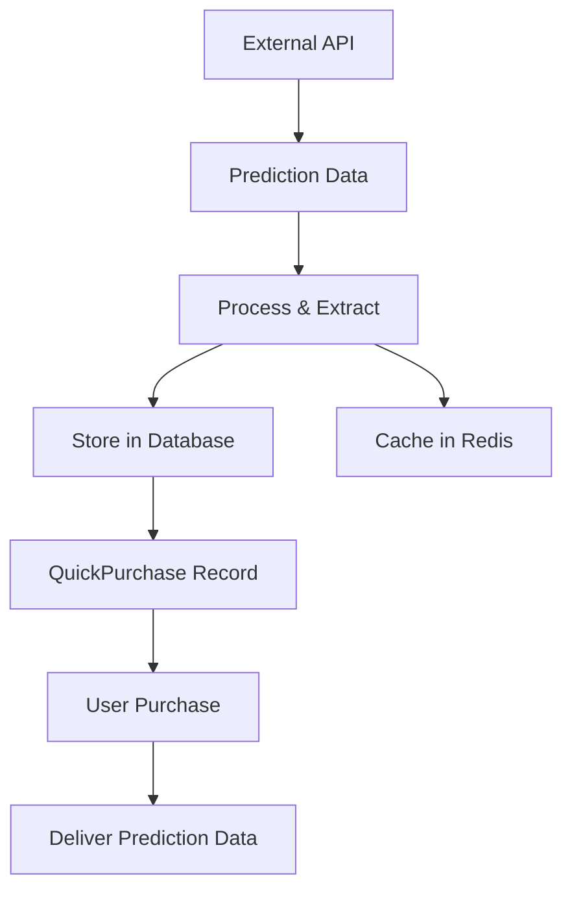

# Prediction QuickPurchase System

## Overview

The Prediction QuickPurchase System allows administrators to create purchasable predictions from external API data and store them in the database. Users can then purchase these predictions through the dashboard and receive the full analysis data.

## Key Features

### 🎯 **Data Storage & Management**
- Store prediction data from external APIs in the database
- Cache predictions in Redis for performance
- Link predictions to specific matches and countries
- Track prediction status and validity

### 💰 **Purchase Flow**
- Users can purchase predictions through QuickPurchase items
- Payment processing with country-specific pricing
- Delivery of full prediction analysis after purchase
- Purchase history tracking

### 🛠️ **Admin Interface**
- Create QuickPurchases from upcoming matches
- Manage prediction data and pricing
- Monitor purchase statistics
- Country-specific configuration

## Database Schema Changes

### Enhanced QuickPurchase Table

```sql
-- New fields added to QuickPurchase table
ALTER TABLE "QuickPurchase" ADD COLUMN "matchId" TEXT;
ALTER TABLE "QuickPurchase" ADD COLUMN "matchData" JSONB;
ALTER TABLE "QuickPurchase" ADD COLUMN "predictionData" JSONB;
ALTER TABLE "QuickPurchase" ADD COLUMN "predictionType" TEXT;
ALTER TABLE "QuickPurchase" ADD COLUMN "confidenceScore" INTEGER;
ALTER TABLE "QuickPurchase" ADD COLUMN "odds" DECIMAL(65,30);
ALTER TABLE "QuickPurchase" ADD COLUMN "valueRating" TEXT;
ALTER TABLE "QuickPurchase" ADD COLUMN "analysisSummary" TEXT;
ALTER TABLE "QuickPurchase" ADD COLUMN "isPredictionActive" BOOLEAN DEFAULT true;
```

### New Fields Explanation

- **matchId**: External match ID from the API
- **matchData**: Full match information (JSON)
- **predictionData**: Complete prediction analysis (JSON)
- **predictionType**: Type of prediction (home_win, away_win, draw)
- **confidenceScore**: AI confidence score (0-100)
- **odds**: Calculated betting odds
- **valueRating**: Value assessment (Low, Medium, High, Very High)
- **analysisSummary**: Brief analysis summary
- **isPredictionActive**: Whether prediction is still valid

## API Endpoints

### Create QuickPurchase from Prediction
- **POST** `/api/predictions/create-quickpurchase`
- **GET** `/api/predictions/create-quickpurchase` - Get available matches

### Purchase Prediction
- **POST** `/api/purchase-tip` - Enhanced to deliver prediction data

### Countries
- **GET** `/api/countries` - Get countries for admin interface

## Usage Workflow

### 1. Admin Creates QuickPurchase

1. Navigate to Admin Panel → Prediction QuickPurchase Manager
2. Select a league and view upcoming matches
3. Click "Create" on an available match
4. Fill in:
   - **Country**: Target country for the purchase
   - **Price**: Purchase price in local currency
   - **Name**: Custom name (optional)
   - **Description**: Custom description (optional)
5. Click "Create QuickPurchase"

### 2. System Process

1. **Fetch Prediction**: Calls external API to get prediction data
2. **Process Data**: Extracts key metrics and analysis
3. **Create Record**: Stores in QuickPurchase table with prediction data
4. **Cache**: Stores prediction in Redis for performance
5. **Link**: Associates with specific match and country

### 3. User Purchase Flow

1. User sees QuickPurchase in dashboard
2. Clicks to purchase
3. Completes payment
4. Receives full prediction analysis including:
   - Match details
   - AI prediction and confidence
   - Detailed reasoning
   - Additional markets
   - Risk analysis
   - Things to avoid

## Data Flow



## Admin Interface Features

### Prediction QuickPurchase Manager

- **Match Overview**: View all upcoming matches (next 72 hours)
- **League Filtering**: Filter by different leagues
- **Search**: Search matches by team or league
- **Status Tracking**: See which matches have QuickPurchases
- **Bulk Creation**: Create multiple QuickPurchases efficiently

### Sync & Enrich System

- **Sync All Upcoming Matches**: Processes all upcoming matches (86 matches typically)
- **Enrich All Predictions (Smart)**: Populates predictions using availability API
- **Real-time Status**: Live counts of total, enriched, and pending matches
- **Enhanced Logging**: Detailed progress tracking with emojis and comprehensive data

### Statistics Dashboard

- **Total Matches**: Number of upcoming matches (86+ typically)
- **Enriched Matches**: Matches with complete prediction data
- **Pending Matches**: Matches awaiting enrichment
- **Success Rate**: Enrichment success percentage

## Purchase Delivery Format

When a user purchases a prediction, they receive:

```json
{
  "success": true,
  "purchase": {
    "id": "purchase-id",
    "amount": "5.00",
    "status": "completed",
    "quickPurchase": {
      "id": "quickpurchase-id",
      "name": "Manchester United vs Liverpool - Expert Prediction",
      "price": "5.00"
    }
  },
  "prediction": {
    "match": {
      "homeTeam": { "name": "Manchester United" },
      "awayTeam": { "name": "Liverpool" },
      "league": { "name": "Premier League" },
      "dateTime": "2024-01-15T20:00:00Z",
      "venue": "Old Trafford",
      "importance": "High"
    },
    "prediction": "home_win",
    "odds": "2.15",
    "confidence": 78,
    "analysis": "AI predicts home win with high confidence...",
    "valueRating": "High",
    "detailedReasoning": [
      "ML model weight 40% → 45% home win probability",
      "No key injuries reported",
      "Home advantage + recent form favors United"
    ],
    "extraMarkets": [
      {
        "market": "Over/Under 2.5",
        "prediction": "Over",
        "probability": 65,
        "reasoning": "Both teams scoring in recent matches"
      }
    ],
    "thingsToAvoid": [
      "Betting on 0-0 draw",
      "High stakes on exact score"
    ],
    "riskLevel": "Medium",
    "confidenceStars": 4,
    "probabilitySnapshot": {
      "homeWin": 45,
      "draw": 28,
      "awayWin": 27
    }
  }
}
```

## Configuration

### Environment Variables

```env
# External API
BACKEND_URL=https://your-api.com
BACKEND_API_KEY=your-api-key

# Redis Cache
REDIS_URL=your-redis-url
REDIS_TOKEN=your-redis-token
```

### League IDs

Common league IDs for reference:
- **39**: Premier League
- **140**: La Liga
- **78**: Bundesliga
- **135**: Serie A
- **61**: Ligue 1

## Best Practices

### 1. **Match Selection**
- Focus on high-profile matches
- Consider match importance and timing
- Avoid matches too close to start time

### 2. **Pricing Strategy**
- Set prices based on match importance
- Consider country-specific purchasing power
- Offer discounts for premium matches

### 3. **Data Quality**
- Verify prediction data before creating QuickPurchase
- Monitor prediction accuracy over time
- Update inactive predictions regularly

### 4. **Performance**
- Use Redis caching for frequently accessed predictions
- Implement proper error handling
- Monitor API rate limits

## Troubleshooting

### Common Issues

#### Prediction Creation Fails
1. Check external API connectivity
2. Verify API credentials
3. Ensure match ID is valid
4. Check database connection

#### Purchase Delivery Issues
1. Verify QuickPurchase has prediction data
2. Check prediction is still active
3. Ensure proper data formatting
4. Monitor purchase logs

#### Cache Issues
1. Check Redis connectivity
2. Verify cache TTL settings
3. Monitor cache hit rates
4. Clear cache if needed

### Debug Commands

```bash
# Test prediction creation
curl -X POST "http://localhost:3000/api/predictions/create-quickpurchase" \
  -H "Content-Type: application/json" \
  -d '{"matchId": 123, "countryId": "country-id", "price": "5.00"}'

# Test purchase
curl -X POST "http://localhost:3000/api/purchase-tip" \
  -H "Content-Type: application/json" \
  -d '{"itemId": "quickpurchase-id", "paymentMethod": "test", "price": "5.00"}'
```

## Recent System Improvements (September 2025)

### ✅ **Sync & Enrich System Overhaul**
- **Fixed Critical Issue**: "Sync & Enrich Matches" now processes all 86 upcoming matches instead of just 37
- **Improved Date Filtering**: Moved from JavaScript to SQL-level filtering for accuracy
- **Enhanced UI**: Simplified from 7 buttons to 2 main actions (Sync All + Enrich All)
- **Better Logging**: Added comprehensive progress tracking with detailed metrics

### ✅ **Data Processing Improvements**
- **All Matches Processed**: System now refreshes ALL upcoming matches, not just unenriched ones
- **Availability API Integration**: Only enriches matches marked as "ready" by external API
- **Real-time Status Updates**: Live counts of total, enriched, and pending matches
- **Error Handling**: Enhanced error context and retry logic

### ✅ **Performance Optimizations**
- **Database-Level Filtering**: More reliable than application-level filtering
- **Batch Processing**: Efficient handling of large match datasets
- **Smart Enrichment**: Selective processing based on availability criteria

## Future Enhancements

### Planned Features
- **Automated Creation**: Schedule QuickPurchase creation
- **Prediction Updates**: Update predictions as match approaches
- **Analytics Dashboard**: Track prediction performance
- **Bulk Operations**: Create multiple QuickPurchases at once
- **Advanced Filtering**: Filter by confidence, odds, etc.

### Integration Opportunities
- **Payment Processors**: Integrate with Stripe, PayPal, etc.
- **Notification System**: Alert users about new predictions
- **Social Features**: Share predictions on social media
- **Mobile App**: Native mobile application

---

## Support

For questions or issues with the Prediction QuickPurchase System:

1. Check the troubleshooting section above
2. Review API documentation
3. Check server logs for detailed error messages
4. Contact the development team

**Last Updated**: December 2024
**Version**: 1.0.0 