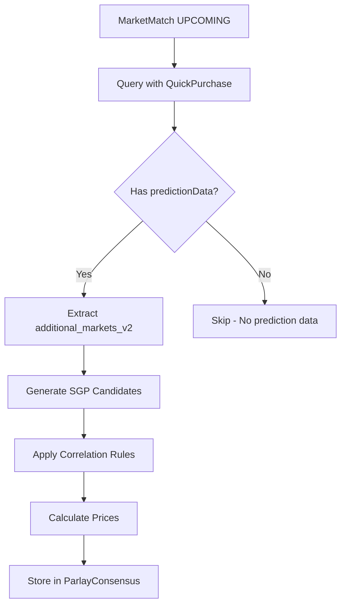

# Single-Game Parlay (SGP) Feasibility Analysis

**Date**: January 2025  
**Status**: ✅ **FEASIBLE - READY FOR IMPLEMENTATION**  
**Priority**: HIGH - New Revenue Stream

---

## 🎯 **Executive Summary**

**Question**: Can we create single-game parlays (SGPs) from `QuickPurchase.predictionData.additional_markets_v2` for matches with `status='UPCOMING'` in the `MarketMatch` table?

**Answer**: ✅ **YES - FULLY FEASIBLE**

**Key Findings**:
1. ✅ All required data is available in `QuickPurchase.predictionData.additional_markets_v2`
2. ✅ MarketMatch table has UPCOMING matches with proper structure
3. ✅ Parlay system infrastructure already exists (ParlayConsensus, ParlayLeg tables)
4. ✅ Rich market data available (totals, BTTS, DNB, Asian Handicap, team totals, etc.)
5. ✅ Lambda values available for correlation-aware pricing

---

## 📊 **Data Availability Analysis**

### **1. QuickPurchase.predictionData Structure**

Based on the provided example and codebase analysis, `predictionData` contains:

```typescript
interface PredictionData {
  // Main prediction
  predictions: {
    home_win: number
    draw: number
    away_win: number
    confidence: number
    recommended_bet: string
  }
  
  // V2 Additional Markets (RICH DATA)
  additional_markets_v2: {
    // Draw No Bet
    dnb: {
      home: number  // 0.775
      away: number  // 0.225
    }
    
    // Both Teams to Score
    btts: {
      yes: number   // 0.589
      no: number   // 0.411
    }
    
    // Totals (Multiple Lines)
    totals: {
      "0_5": { over: 0.962, under: 0.038 }
      "1_5": { over: 0.838, under: 0.162 }
      "2_5": { over: 0.634, under: 0.366 }
      "3_5": { over: 0.413, under: 0.587 }
      "4_5": { over: 0.232, under: 0.768 }
    }
    
    // Lambda values (for correlation pricing)
    lambdas: {
      home: number   // 2.18
      away: number   // 1.09
      fit_loss: number
    }
    
    // Coherence validation
    coherence: {
      hda_sum: number
      fit_loss: number
      // ... validation flags
    }
    
    // Win to Nil
    win_to_nil: {
      home: number  // 0.298
      away: number  // 0.075
    }
    
    // Clean Sheet
    clean_sheet: {
      home: number  // 0.336
      away: number  // 0.113
    }
    
    // Team Totals
    team_totals: {
      home: {
        "0_5": { over: 0.887, under: 0.113 }
        "1_5": { over: 0.641, under: 0.359 }
        "2_5": { over: 0.372, under: 0.628 }
      }
      away: {
        "0_5": { over: 0.664, under: 0.336 }
        "1_5": { over: 0.297, under: 0.703 }
        "2_5": { over: 0.098, under: 0.902 }
      }
    }
    
    // Double Chance
    double_chance: {
      "12": number  // 0.801 (home or away)
      "1X": number  // 0.82 (home or draw)
      "X2": number  // 0.379 (draw or away)
    }
    
    // Asian Handicap (Multiple Lines)
    asian_handicap: {
      home: {
        "_minus_0_5": { win: 0.622, lose: 0.378 }
        "_minus_1": { win: 0.393, lose: 0.378, push: 0.229 }
        "_minus_1_5": { win: 0.393, lose: 0.607 }
        // ... more lines
      }
      away: {
        "_plus_0_5": { win: 0.378, lose: 0.622 }
        "_plus_1": { win: 0.378, lose: 0.622, push: 0.198 }
        // ... more lines
      }
    }
    
    // Correct Scores
    correct_scores: Array<{
      p: number    // 0.098
      score: string // "2-1"
    }>
    
    // Odd/Even Total
    odd_even_total: {
      odd: number   // 0.499
      even: number  // 0.501
    }
    
    // Winning Margin
    winning_margin: {
      "0": number   // 0.198 (draw)
      "+1": number  // 0.229 (home by 1)
      "+2": number  // 0.187 (home by 2)
      "-1": number  // 0.114 (away by 1)
      // ... more
    }
  }
  
  // Also available: additional_markets_flat (flattened version)
  additional_markets_flat: {
    totals_over_2_5: number
    totals_under_2_5: number
    btts_yes: number
    btts_no: number
    // ... all markets flattened
  }
}
```

**✅ Conclusion**: Rich market data is available for SGP generation.

---

### **2. MarketMatch UPCOMING Query**

**Current Implementation**: ✅ Already exists

```typescript
// From app/api/admin/predictions/sync-from-availability/route.ts
const upcomingMarketMatches = await prisma.marketMatch.findMany({
  where: {
    status: 'UPCOMING',
    isActive: true,
    kickoffDate: { gte: new Date() }
  },
  include: {
    quickPurchases: {
      where: {
        isActive: true,
        isPredictionActive: true,
        predictionData: { not: Prisma.JsonNull }
      }
    }
  }
})
```

**✅ Conclusion**: Can easily query UPCOMING matches with prediction data.

---

### **3. Data Flow for SGP Generation**



**✅ Conclusion**: Data flow is straightforward and feasible.

---

## 🏗️ **Architecture Analysis**

### **1. Existing Parlay Infrastructure**

**Tables Already Exist**:
- ✅ `ParlayConsensus` - Main parlay records
- ✅ `ParlayLeg` - Individual legs
- ✅ `ParlayPurchase` - User purchases
- ✅ `ParlayPerformance` - Performance tracking

**Current Usage**: Multi-game parlays from backend API

**SGP Adaptation**: Need to add `parlayType = 'single_game'` or `'sgp'` field

**✅ Conclusion**: Infrastructure exists, just need to adapt for SGPs.

---

### **2. Market Selection for SGPs**

Based on the provided design document, we can create:

**Safe Builder (2-3 legs)**:
- Double Chance (1X/X2)
- Under 3.5 / Under 4.5
- BTTS No
- DNB
- +0.5 AH underdog

**Balanced Value (2-3 legs)**:
- DNB + Totals
- 1X2 + Totals
- Clean Sheet OR BTTS No

**Aggressive Edge (3-4 legs)**:
- 1X2 + Under 2.5
- Win to Nil
- Winning Margin +1
- Team Totals

**✅ Conclusion**: All required markets are available in `additional_markets_v2`.

---

## 💰 **Pricing Feasibility**

### **1. Probability Data Available**

✅ All markets have `p_model` values:
- `totals["2_5"].over` = 0.634
- `btts.yes` = 0.589
- `dnb.home` = 0.775
- etc.

**✅ Conclusion**: Can calculate fair odds: `fair_odds = 1 / p_model`

---

### **2. Correlation Data Available**

✅ Lambda values available:
```typescript
lambdas: {
  home: 2.18,
  away: 1.09,
  fit_loss: 0.000001
}
```

**Use Case**: 
- If `(lambda_h + lambda_a) <= 2.0` → Low scoring → Stronger correlation penalty for GOALS_LOW legs
- If `(lambda_h + lambda_a) >= 3.0` → High scoring → Weaker correlation penalty

**✅ Conclusion**: Can implement lambda-aware correlation adjustments.

---

### **3. Coherence Validation**

✅ Coherence data available:
```typescript
coherence: {
  hda_sum: 1,
  fit_loss: 0.000001,
  hda_sum_valid: true,
  dnb_sums_valid: true,
  btts_sums_valid: true,
  totals_pairs_sum_valid: true,
  // ... more validation flags
}
```

**✅ Conclusion**: Can validate parlay coherence before creation.

---

## 🎨 **Admin Page Design**

### **Proposed Location**

**Option A**: New Admin Page `/admin/single-game-parlays` ✅ **RECOMMENDED**

**Option B**: Add to existing `/admin` page as collapsible section

**Recommendation**: **Option A** - Dedicated page for better UX

---

### **Page Structure**

```
/admin/single-game-parlays
├── Header
│   ├── Title: "Single-Game Parlay Generator"
│   ├── Stats: Total matches, Available SGPs, Generated today
│   └── Actions: Generate All, Export, Settings
│
├── Filters
│   ├── League filter
│   ├── Date range
│   ├── Min confidence threshold
│   └── Market type filter
│
├── Match List
│   ├── For each UPCOMING match:
│   │   ├── Match info (teams, league, kickoff)
│   │   ├── Prediction status (has predictionData?)
│   │   ├── Available markets count
│   │   ├── Generated SGPs count
│   │   └── Actions: Generate SGPs, View Details
│
└── SGP Preview Modal
    ├── Generated parlays list
    ├── Each parlay shows:
    │   ├── Legs (2-4 legs)
    │   ├── Combined probability
    │   ├── Correlation factor
    │   ├── Final odds
    │   └── Actions: Create, Edit, Delete
```

---

### **Component Structure**

```
components/admin/single-game-parlays/
├── SingleGameParlayGenerator.tsx    # Main page component
├── MatchList.tsx                    # List of UPCOMING matches
├── MatchCard.tsx                    # Individual match card
├── SGPGenerator.tsx                 # SGP generation logic
├── SGPPreviewModal.tsx              # Preview generated parlays
├── SGPBuilder.tsx                   # Manual parlay builder
├── CorrelationCalculator.tsx        # Correlation pricing
└── ParlayPricing.tsx                # Auto-pricing logic
```

---

## 🔧 **Implementation Plan**

### **Phase 1: Data Extraction & Validation (Week 1)**

**Tasks**:
1. ✅ Create API endpoint to query UPCOMING matches with predictionData
2. ✅ Extract `additional_markets_v2` from QuickPurchase records
3. ✅ Validate data structure and completeness
4. ✅ Create TypeScript interfaces for market data

**API Endpoint**:
```typescript
GET /api/admin/single-game-parlays/matches
// Returns: Array of matches with predictionData.additional_markets_v2
```

---

### **Phase 2: SGP Generation Logic (Week 1-2)**

**Tasks**:
1. ✅ Implement market normalization layer (Selection type)
2. ✅ Create candidate leg pool generation
3. ✅ Implement hard constraints (contradiction filters, correlation caps)
4. ✅ Build parlay construction algorithm
5. ✅ Add scoring system (probability + value + narrative)

**Core Functions**:
```typescript
// Market normalization
function normalizeMarkets(additional_markets_v2): Selection[]

// Candidate generation
function generateCandidateLegs(selections: Selection[], bucket: 'safe' | 'balanced' | 'aggressive'): Selection[]

// Parlay construction
function buildParlays(candidates: Selection[], bucket: string): ParlayCandidate[]

// Correlation calculation
function calculateCorrelation(legs: Selection[], lambdas: LambdaData): number
```

---

### **Phase 3: Auto-Pricing Implementation (Week 2)**

**Tasks**:
1. ✅ Convert model probabilities to fair odds
2. ✅ Implement correlation adjustment (tag-based)
3. ✅ Apply house margin (bucket-based scaling)
4. ✅ Handle push/half-win markets (Asian Handicap)
5. ✅ Final parlay price calculation

**Pricing Formula**:
```typescript
// 1. Fair odds per leg
O_i = 1 / p_i

// 2. Independence parlay odds
O_ind = Π O_i

// 3. Correlation adjustment
O_corr = O_ind * corr_factor

// 4. House margin
O_final = O_corr / (1 - margin_total)
```

---

### **Phase 4: Admin UI (Week 2-3)**

**Tasks**:
1. ✅ Create `/admin/single-game-parlays` page
2. ✅ Build match list component
3. ✅ Implement SGP generation UI
4. ✅ Add preview modal
5. ✅ Create parlay builder interface
6. ✅ Add filtering and search

---

### **Phase 5: Database Integration (Week 3)**

**Tasks**:
1. ✅ Store generated SGPs in `ParlayConsensus` table
2. ✅ Link legs to match via `matchId` in `ParlayLeg`
3. ✅ Set `parlayType = 'single_game'` or `'sgp'`
4. ✅ Add metadata (correlation factor, margin, etc.)
5. ✅ Create sync/update mechanism

**Schema Adaptation**:
```prisma
model ParlayConsensus {
  // ... existing fields ...
  parlayType        String   // "single_game" | "same_league" | "cross_league"
  matchId           String?  // NEW: For single-game parlays
  correlationFactor Decimal? // NEW: Stored correlation adjustment
  marginApplied     Decimal? // NEW: House margin used
}
```

---

### **Phase 6: Testing & Validation (Week 4)**

**Tasks**:
1. ✅ Test with real match data
2. ✅ Validate pricing accuracy
3. ✅ Test correlation calculations
4. ✅ Verify coherence validation
5. ✅ Performance testing (large datasets)
6. ✅ Edge case handling

---

## 📋 **Technical Requirements**

### **1. Data Dependencies**

**Required**:
- ✅ MarketMatch table with UPCOMING matches
- ✅ QuickPurchase records with `predictionData` populated
- ✅ `additional_markets_v2` in predictionData
- ✅ Lambda values for correlation

**Optional**:
- `additional_markets_flat` (alternative data source)
- `coherence` validation data

---

### **2. API Endpoints Needed**

```typescript
// Get matches with prediction data
GET /api/admin/single-game-parlays/matches
Query: ?leagueId=xxx&dateFrom=xxx&dateTo=xxx

// Generate SGPs for a match
POST /api/admin/single-game-parlays/generate
Body: { matchId: string, bucket?: 'safe' | 'balanced' | 'aggressive' }

// Preview generated parlays
GET /api/admin/single-game-parlays/preview/:matchId

// Create parlay from candidate
POST /api/admin/single-game-parlays/create
Body: { matchId: string, legs: Selection[], bucket: string }

// Get existing SGPs for a match
GET /api/admin/single-game-parlays/match/:matchId
```

---

### **3. TypeScript Interfaces**

```typescript
interface Selection {
  id: string
  market: string              // "TOTALS_U2_5", "BTTS_NO", "DNB_HOME"
  side: "HOME" | "AWAY" | "DRAW" | "YES" | "NO" | "OVER" | "UNDER"
  line?: number               // 2.5, 0.5, -0.25
  p_model: number              // Model probability [0,1]
  settle: "WIN_LOSE" | "WIN_LOSE_PUSH" | "WIN_HALF_WIN_HALF_LOSE"
  tags: string[]               // ["GOALS_LOW", "TOTALS", "UNDER"]
}

interface ParlayCandidate {
  id: string
  matchId: string
  legs: Selection[]
  bucket: 'safe' | 'balanced' | 'aggressive' | 'longshot'
  combinedProb: number
  correlationFactor: number
  fairOdds: number
  finalOdds: number
  margin: number
  edge: number
  confidence: number
}

interface MatchWithSGPs {
  matchId: string
  homeTeam: string
  awayTeam: string
  league: string
  kickoffDate: Date
  hasPredictionData: boolean
  availableMarkets: number
  generatedSGPs: ParlayCandidate[]
}
```

---

## ⚠️ **Potential Challenges & Solutions**

### **Challenge 1: Missing predictionData**

**Problem**: Some UPCOMING matches may not have `predictionData` populated.

**Solution**: 
- Filter matches: `WHERE predictionData IS NOT NULL`
- Show status indicator in UI
- Add "Enrich Match" button to trigger enrichment

---

### **Challenge 2: Data Structure Variations**

**Problem**: `additional_markets_v2` structure may vary between matches.

**Solution**:
- Add validation layer
- Use fallback to `additional_markets_flat` if v2 missing
- Graceful degradation for missing markets

---

### **Challenge 3: Performance with Large Datasets**

**Problem**: Generating SGPs for 100+ matches could be slow.

**Solution**:
- Batch processing (10 matches at a time)
- Background job for bulk generation
- Caching generated parlays
- Lazy loading in UI

---

### **Challenge 4: Correlation Calculation Complexity**

**Problem**: Calculating correlation for all leg combinations is computationally expensive.

**Solution**:
- Pre-compute correlation matrix by tags
- Use simplified correlation rules (6-8 fixed pairs)
- Cache correlation factors
- Limit to top K parlays per bucket

---

## ✅ **Feasibility Conclusion**

### **✅ FULLY FEASIBLE**

**Reasons**:
1. ✅ All required data is available in `additional_markets_v2`
2. ✅ MarketMatch UPCOMING query already implemented
3. ✅ Parlay infrastructure exists (tables, APIs)
4. ✅ Rich market data (totals, BTTS, DNB, AH, team totals, etc.)
5. ✅ Lambda values available for correlation pricing
6. ✅ Coherence validation data available
7. ✅ Admin page structure follows existing patterns

**Estimated Timeline**: 3-4 weeks

**Recommended Approach**:
1. Start with **Safe Builder** (2-3 legs, simple markets)
2. Add **Balanced Value** bucket
3. Expand to **Aggressive Edge** and **Longshot**
4. Iterate on pricing and correlation rules

---

## 🚀 **Next Steps**

### **Immediate Actions**:
1. ✅ **Approve this analysis**
2. ⏭️ **Create TypeScript interfaces** for market data
3. ⏭️ **Build data extraction API** endpoint
4. ⏭️ **Implement market normalization** layer
5. ⏭️ **Create admin page** structure

### **Week 1 Goals**:
- Data extraction working
- Market normalization complete
- Basic SGP generation (Safe bucket only)

### **Week 2 Goals**:
- All buckets implemented
- Auto-pricing working
- Admin UI functional

### **Week 3 Goals**:
- Database integration
- Testing complete
- Production ready

---

## 📚 **References**

- **Parlay Design Document**: Provided by user (parlay builder logic + auto-pricing)
- **MarketMatch Schema**: `MARKET_MATCH_TABLE_SCHEMA.md`
- **Parlay Implementation**: `PARLAYS_IMPLEMENTATION_ANALYSIS.md`
- **QuickPurchase System**: `PREDICTION_QUICKPURCHASE_SYSTEM.md`

---

**Last Updated**: January 2025  
**Status**: ✅ **FEASIBLE - READY FOR IMPLEMENTATION**  
**Next Review**: After Phase 1 completion

