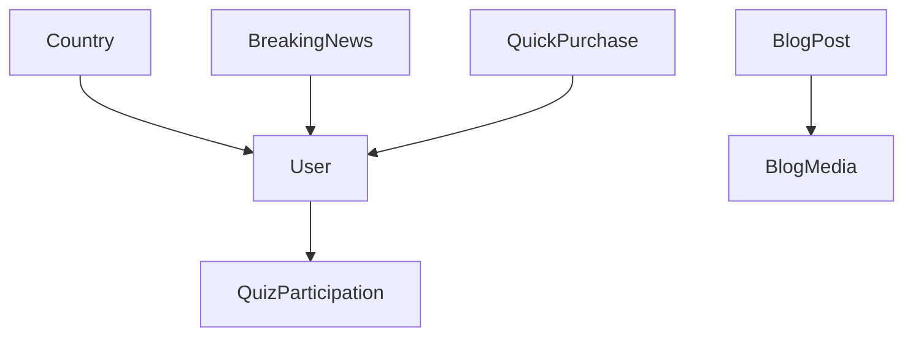
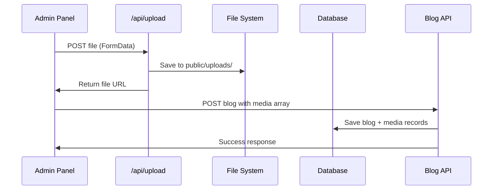
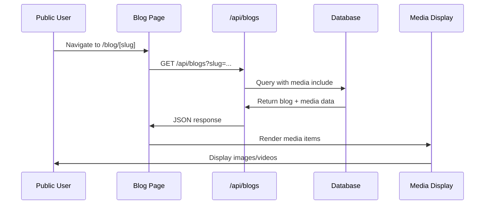
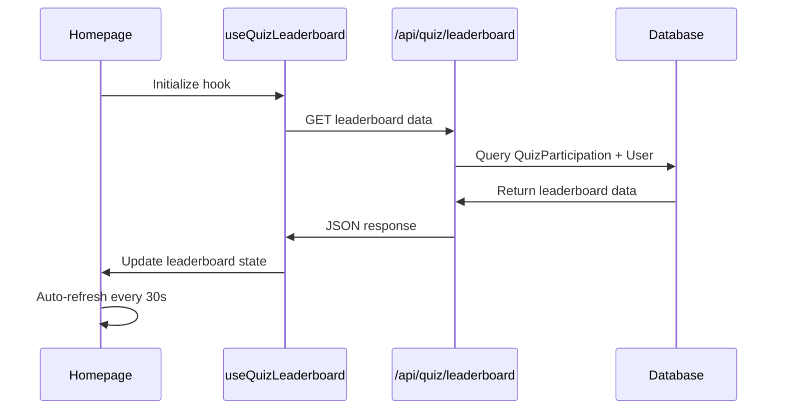

# 🏗️ **Technical Architecture - AI Sports Tipster Platform**

## 🎯 **System Overview**

The AI Sports Tipster platform is built on **Next.js 14** with the **App Router**, using **React 18** for the frontend and **Prisma ORM** with **PostgreSQL** for the backend. The system follows a modern, component-based architecture with clear separation between client and server components.

## 🏛️ **Architecture Layers**

### **1. Presentation Layer (Frontend)**
- **Next.js 14 App Router**: File-based routing system
- **React 18**: Component library with hooks and modern patterns
- **TypeScript**: Type-safe development
- **Tailwind CSS**: Utility-first CSS framework
- **Shadcn UI**: Component library built on Radix UI

### **2. API Layer (Backend)**
- **Next.js API Routes**: RESTful API endpoints in `/app/api/`
- **Prisma ORM**: Database abstraction and query building
- **PostgreSQL**: Primary database with advanced features
- **File System**: Local file storage for media uploads

### **3. Data Layer**
- **Database Schema**: Prisma schema with relations and constraints
- **Migrations**: Version-controlled database schema changes
- **Data Models**: Type-safe interfaces for all data structures

---

## 🗄️ **Database Architecture**

### **Core Models & Relationships**



### **Key Database Models**

#### **User Model**
```prisma
model User {
  id                    String    @id @default(cuid())
  email                 String    @unique
  fullName              String    // ✅ Used for display (not username)
  role                  String    @default("user")
  countryId             String?
  isActive              Boolean   @default(true)
  lastLoginAt           DateTime?
  phone                 String?
  subscriptionExpiresAt DateTime?
  subscriptionPlan      String?
  totalWinnings         Float     @default(0)
  winStreak             Int       @default(0)
  
  // Relations
  country               Country?  @relation(fields: [countryId], references: [id])
  quizParticipations    QuizParticipation[]
  breakingNews          BreakingNews[]
  quickPurchases        QuickPurchase[]
}
```

#### **BlogPost Model (Enhanced)**
```prisma
model BlogPost {
  id                 String    @id @default(cuid())
  title              String
  slug               String    @unique
  excerpt            String?
  content            String
  author             String
  category           String
  tags               String[]
  geoTarget          String[]
  featured           Boolean   @default(false)
  publishedAt        DateTime?
  createdAt          DateTime  @default(now())
  updatedAt          DateTime  @updatedAt
  viewCount          Int       @default(0)
  shareCount         Int       @default(0)
  readTime           Int?
  seoTitle           String?
  seoDescription     String?
  seoKeywords        String[]
  isPublished        Boolean   @default(false)
  isActive           Boolean   @default(true)
  aiGenerated        Boolean   @default(false)
  scheduledPublishAt DateTime?
  sourceUrl          String?
  
  // New Media Relation
  media              BlogMedia[]
}
```

#### **BlogMedia Model (New)**
```prisma
model BlogMedia {
  id          String   @id @default(cuid())
  blogPostId  String
  type        String   // 'image' or 'video'
  url         String   // Relative path or full URL
  filename    String
  size        Int
  alt         String?  // Alt text for accessibility
  caption     String?  // Optional caption
  uploadedAt  DateTime @default(now())
  
  // Relations
  blogPost    BlogPost @relation(fields: [blogPostId], references: [id], onDelete: Cascade)
  
  // Indexes for performance
  @@index([blogPostId])
  @@index([type])
  @@index([uploadedAt])
}
```

#### **QuizParticipation Model**
```prisma
model QuizParticipation {
  id        String   @id @default(cuid())
  userId    String
  quizId    String
  score     Int
  answers   Json
  completedAt DateTime @default(now())
  
  // Relations
  user      User     @relation(fields: [userId], references: [id], onDelete: Cascade)
}
```

---

## 🔄 **Data Flow Architecture**

### **1. Media Upload Flow**


### **2. Blog Display Flow**


### **3. Quiz Leaderboard Flow**


---

## 🧩 **Component Architecture**

### **Component Hierarchy**

```
app/
├── page.tsx (Homepage)
│   ├── ResponsiveHero
│   ├── LivePredictionsTicker
│   ├── ValueProposition ✨ NEW
│   ├── SportsbookCompanion ✨ NEW
│   ├── QuizSection (Enhanced)
│   ├── StatsSection
│   └── TrustBadges
├── blog/
│   ├── page.tsx (Blog List)
│   └── [slug]/page.tsx (Single Blog)
│       └── BlogMediaDisplay ✨ NEW
└── admin/
    └── blogs/
        ├── create/page.tsx
        └── [id]/page.tsx
            └── MediaUpload ✨ NEW
```

### **Key Component Details**

#### **ValueProposition Component**
- **Purpose**: Display SnapBet's 10 value pillars
- **Type**: Server Component
- **Features**: Icons, titles, descriptions for each value proposition
- **Location**: `components/value-proposition.tsx`

#### **SportsbookCompanion Component**
- **Purpose**: Explain how SnapBet complements sportsbooks
- **Type**: Server Component
- **Features**: Clear messaging about complementary role
- **Location**: `components/sportsbook-companion.tsx`

#### **MediaUpload Component**
- **Purpose**: Handle file uploads in admin panel
- **Type**: Client Component (`"use client"`)
- **Features**: Drag & drop, file validation, preview, alt text/caption editing
- **Location**: `components/admin/media-upload.tsx`

#### **BlogMediaDisplay Component**
- **Purpose**: Display media on public blog pages
- **Type**: Client Component (`"use client"`)
- **Features**: Image/video rendering, responsive grid, error handling
- **Location**: `components/blog-media-display.tsx`

#### **QuizSection Component (Enhanced)**
- **Purpose**: Display real-time quiz leaderboard
- **Type**: Server Component
- **Features**: Dynamic data from `useQuizLeaderboard` hook
- **Location**: `components/quiz-section.tsx`

---

## 🔌 **API Architecture**

### **API Endpoints Structure**

```
/api/
├── auth/
│   └── session
├── blogs/
│   ├── route.ts (GET all, POST new)
│   └── [id]/route.ts (GET, PUT, DELETE single)
├── quiz/
│   └── leaderboard/route.ts ✨ NEW
├── upload/route.ts ✨ NEW
├── user/
│   └── profile
└── admin/
    ├── breaking-news
    └── system-health
```

### **Key API Endpoints**

#### **Quiz Leaderboard API**
```typescript
// GET /api/quiz/leaderboard
// Parameters: limit, includeCurrentUser, userId
// Response: LeaderboardEntry[] with user details
```

#### **File Upload API**
```typescript
// POST /api/upload
// Body: FormData with file
// Response: { success: true, data: { url, filename, size, type } }
```

#### **Blog Media API**
```typescript
// GET /api/blogs?slug=... (includes media)
// PUT /api/blogs/[id] (handles media updates via transaction)
```

---

## 🎨 **UI/UX Architecture**

### **Design System**
- **Color Scheme**: Slate-based dark theme with emerald accents
- **Typography**: Consistent text hierarchy and spacing
- **Components**: Reusable UI components with consistent styling
- **Responsiveness**: Mobile-first design with responsive breakpoints

### **Layout Patterns**
- **Grid Systems**: CSS Grid for media layouts
- **Card Components**: Consistent card design for content sections
- **Spacing**: Tailwind spacing scale for consistent margins/padding
- **Icons**: Lucide React icons for consistent iconography

---

## 🔒 **Security Architecture**

### **Authentication & Authorization**
- **NextAuth.js**: Session management and authentication
- **Role-based Access**: Admin vs user permissions
- **Middleware**: Route protection and token validation

### **File Upload Security**
- **File Type Validation**: Only image/video files allowed
- **Size Limits**: 10MB for images, 100MB for videos
- **Path Traversal Protection**: Secure file naming and storage
- **Upload Directory**: Isolated to `public/uploads/`

---

## 📊 **Performance Architecture**

### **Optimization Strategies**
- **Server Components**: Reduce client-side JavaScript
- **Image Optimization**: Proper sizing and formats
- **Database Indexing**: Strategic indexes on frequently queried fields
- **Caching**: Next.js built-in caching mechanisms

### **Monitoring Points**
- **API Response Times**: Track endpoint performance
- **Database Query Performance**: Monitor complex queries
- **File Upload Performance**: Track upload speeds and success rates
- **Memory Usage**: Monitor component memory consumption

---

## 🚀 **Deployment Architecture**

### **Current Setup**
- **Development**: Local PostgreSQL + file system storage
- **File Storage**: Local `public/uploads/` directory
- **Database**: Local PostgreSQL instance

### **Production Considerations**
- **File Storage**: Migrate to cloud storage (AWS S3, Cloudinary)
- **Database**: Production PostgreSQL with connection pooling
- **CDN**: Implement CDN for media assets
- **Environment Variables**: Configure production URLs and secrets

---

## 🔍 **Debugging & Monitoring**

### **Development Tools**
- **Console Logging**: Comprehensive logging in media components
- **Error Boundaries**: Graceful error handling for media failures
- **TypeScript**: Compile-time error checking
- **Prisma Studio**: Database inspection and debugging

### **Production Monitoring**
- **API Logging**: Request/response logging
- **Error Tracking**: Error rate monitoring
- **Performance Metrics**: Response time tracking
- **File Upload Monitoring**: Success/failure rates

---

## 📋 **Next Agent Responsibilities**

### **Immediate Tasks**
1. **Verify System Health**: Run build and test all functionality
2. **Test Media System**: Upload and display test images/videos
3. **Check Leaderboard**: Verify quiz data integration
4. **Performance Review**: Monitor API response times

### **Architecture Improvements**
1. **Image Optimization**: Implement Next.js Image component
2. **Cloud Storage**: Plan migration from local file system
3. **Caching Strategy**: Implement Redis or similar for performance
4. **Monitoring**: Set up production monitoring and alerting

---

**Document Created**: August 24, 2025  
**Purpose**: Technical architecture reference for development team  
**Status**: Comprehensive system overview and component documentation
